# Assignment 3

Name: Yerali Karkinbayev  
Group: IT-2501  
Course: Web Technologies

## How to open

Open "index.html" in a browser. 

I showed all the possible ways of opening my site: mobile, tablet, dekstop.

## Part 1: Media Queries

### Task 0: Responsive Typography

Mobile (390px):

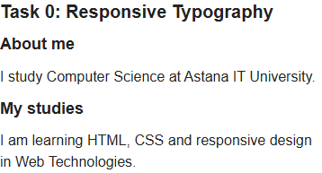

Tablet (1032px):

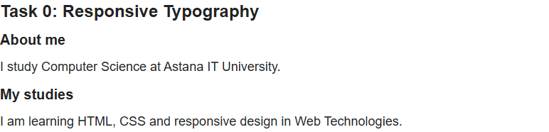

Desktop (1280px):

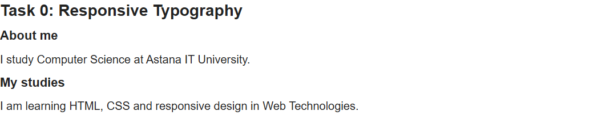

### Task 1: Media Query Layout

Mobile (390px):

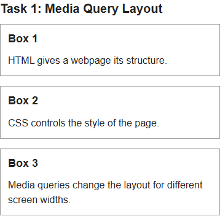

Tablet (1032px):

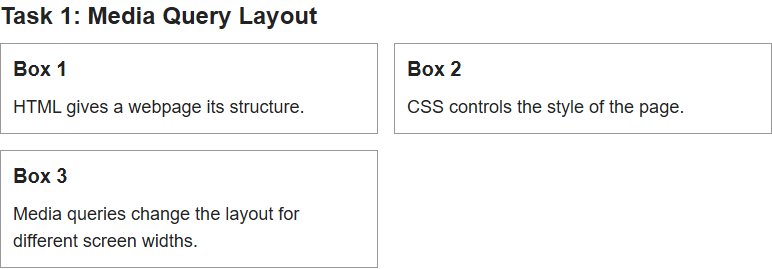

Desktop (1280px):

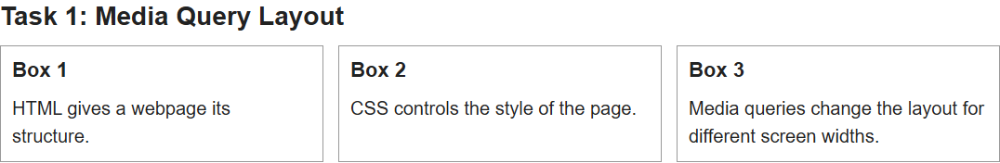

## Part 2: Bootstrap Grid System

### Task 2: Bootstrap Columns

Mobile (390px):

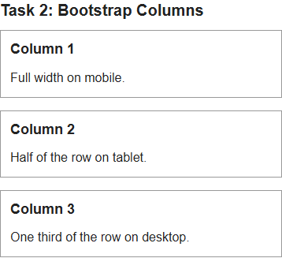

Tablet (1032px):

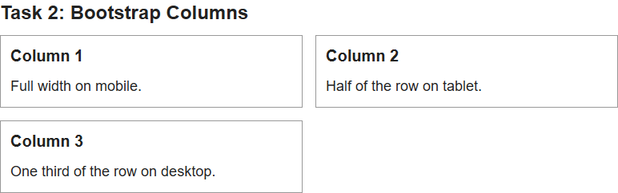

Desktop (1280px):

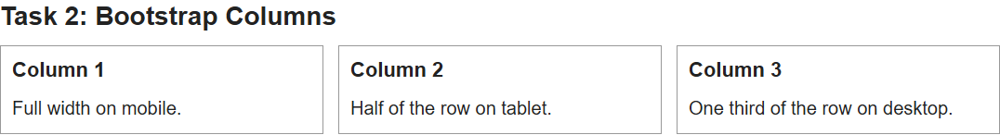

### Task 3: Bootstrap Navigation Bar

Mobile (390px):

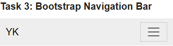

Mobile menu open:

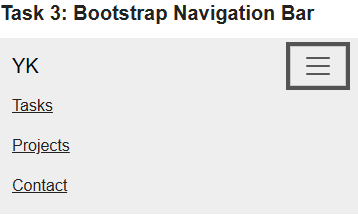

Tablet (1032px):

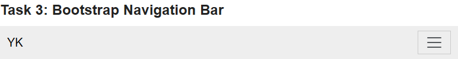

Desktop (1280px):

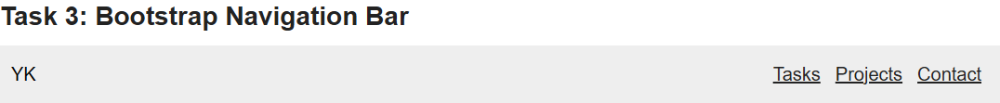

## Part 3: Combined Project

### Task 4: Responsive Portfolio

Mobile (390px):

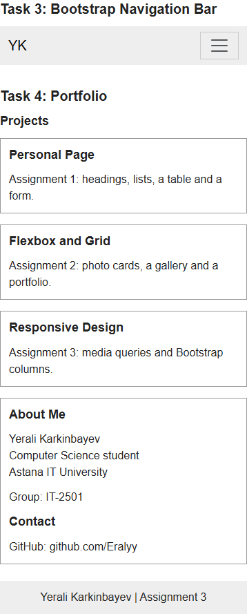

Tablet (1032px):

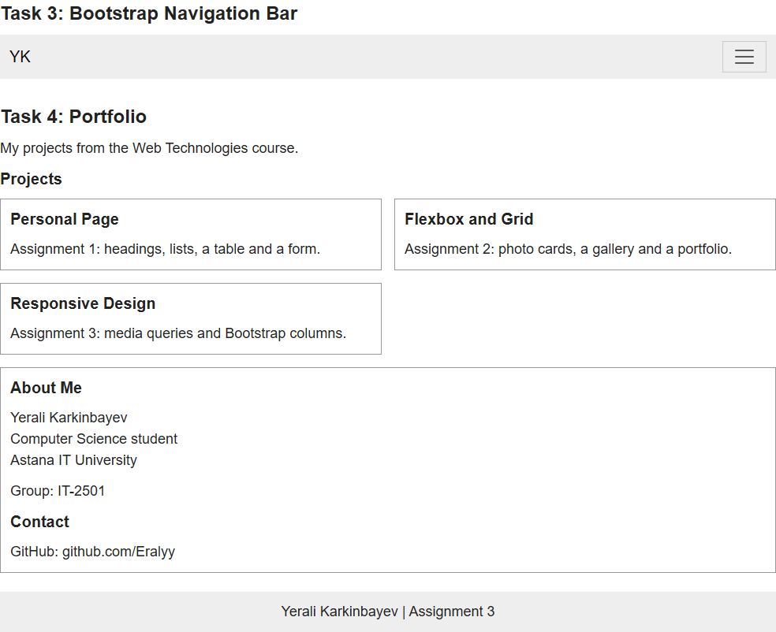

Desktop (1280px):

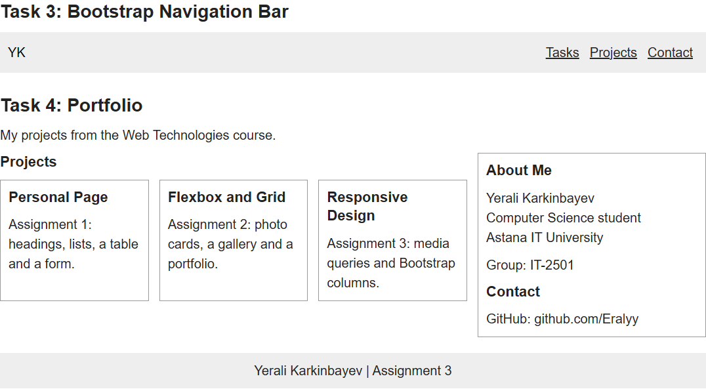

## Main files

- index.html: all five tasks.
- css/style.css: custom styles and media queries.
- vendor/bootstrap/: local Bootstrap CSS, JavaScript and license.
- screenshots/: mobile, tablet and desktop screenshots.

## Work summary

The page uses HTML, CSS media queries, and Bootstrap 5.3.8. Tasks 0–1 use custom CSS, while Tasks 2–4 use Bootstrap for the grid and navbar. The only JavaScript is used for the mobile menu.

The page was tested offline at 3 screen sizes from 390px to 1280px. The menu and section links work correctly. Task 1 also works without Bootstrap. Screenshots show the page on mobile, tablet, and desktop.

